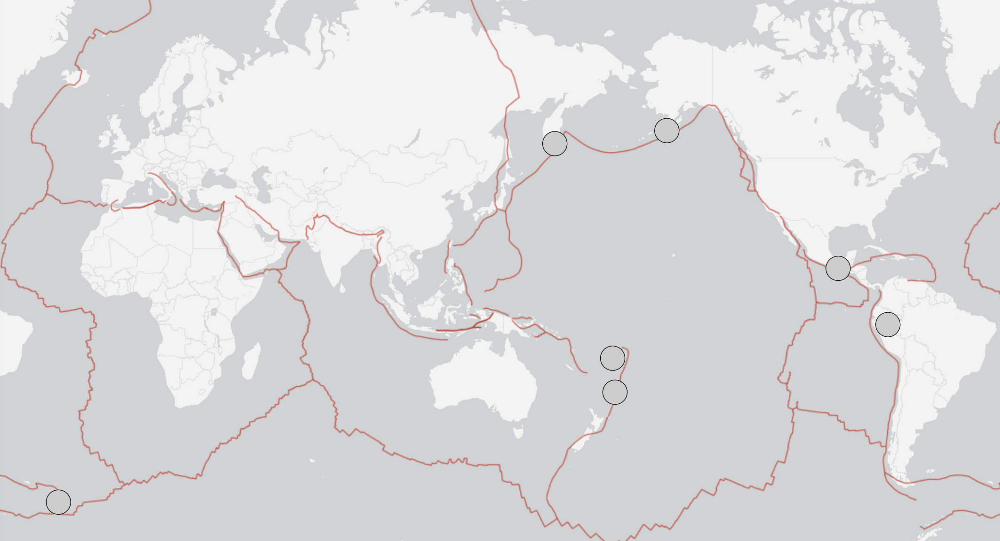

```{r setup, include=FALSE}
library(dplyr)
library(rstan)
library(tidyverse)
library(bayesrules)
library(MASS)
library(rstanarm)
library(ggplot2)
library(bayesplot)
```


```{r loadData, include=FALSE}
prior_eqs <- read_csv("data/earthquakes_before_1950.csv")

prior <- prior_eqs[, c("time", "mag")]
prior$datetime <- as.POSIXct(prior$time, format = "%Y-%m-%dT%H:%M:%OSZ", tz = "UTC")
prior <- prior[order(prior$datetime), ]
prior$intertime <- c(NA, as.numeric(
  difftime(prior$datetime[-1],prior$datetime[-nrow(prior)], units="days")))
prior$Display <- round(prior$intertime, 2)

between_time <- prior$intertime[!is.na(prior$intertime)]
E_T <- mean(between_time)
shape <- 2
rate <- 2 / E_T

theta_exp <- rate
theta_var <- theta_exp^2 / 5
b <- theta_exp / theta_var
a <- theta_exp * b

data <- read.csv("data/earthquake.csv")
earthquake <- data[, c("time", "mag")]
earthquake$datetime <- as.POSIXct(earthquake$time, format = "%Y-%m-%dT%H:%M:%OSZ", tz = "UTC")
earthquake <- earthquake[order(earthquake$datetime), ]
earthquake$intertime <- c(NA, as.numeric(
  difftime(earthquake$datetime[-1],earthquake$datetime[-nrow(earthquake)], units="days")))
earthquake$Display <- round(earthquake$intertime, 2)

tObs <- earthquake$intertime[!is.na(earthquake$intertime)]
n <- length(tObs)
sum_t <- sum(earthquake$intertime, na.rm = TRUE)
lastDate <- max(earthquake$datetime)
xDay <- as.numeric(difftime(Sys.Date(), lastDate, units="days"))

aPost <- a + 2*n
bPost <- b + sum_t

model <- "
data {
  int<lower=1> N;
  vector<lower=0>[N] T;
}
parameters {
  real<lower=0> theta;
}
model {
  T ~ gamma(2, theta);
  theta ~ gamma(5.0, 1120.523);
}
"

simulation <- stan(model_code=model, data=list(N = n, T = tObs),
                   chains=4, iter=5000*2, seed=1234,
                   refresh=FALSE)

postTheta <- as.data.frame(simulation, pars = "theta")$theta
priorTheta <- rgamma(10000, shape = a, rate = b)
cred_int_95 <- quantile(postTheta, probs = c(0.025, 0.975))

remainDays <- (xDay + 2/postTheta) / (1 + postTheta * xDay)

check_sim <- as.data.frame(simulation)
check_sim <- check_sim %>%
  mutate(y_predict = rgamma(n = n(), shape = 2, rate = theta))
check_sim <- check_sim %>%
  mutate(days_from_today = y_predict - xDay)
check_sim_future <- check_sim %>%
  filter(days_from_today > 0)
```


## Motivation

Earthquakes of magnitude 8 or above occur roughly once per year worldwide. Despite their rarity, they account for a disproportionate share of seismic fatalities and infrastructure damage. Even coarse probabilistic forecasts of when the next event might occur can inform resource allocation and preparedness planning.

::: {.columns}
::: {.column width="55%"}
We address two questions using Bayesian inference on historical USGS data:

**Q1.** Given `r round(xDay)` days have elapsed since the last M8+ earthquake, what is the expected remaining waiting time?

**Q2.** What is the probability the next M8+ earthquake occurs within $d$ days from now?

:::
::: {.column width="45%"}
{width=100%}
```{r fig0-caption, echo=FALSE, results='asis'}
cat("<p style='font-size:0.60em; color:gray; margin-top:-10px;'>Fig 1. Global M8+ earthquakes, sourced from the USGS Earthquake Catalog.</p>")
```
:::
:::


## Data

::: {.columns}
::: {.column width="50%"}
We use the USGS Earthquake Catalog filtered to $M \geq 8.0$, converted to inter-event times (days between consecutive earthquakes).

**Pre-1950** (39 events, 38 inter-event times): used to construct the informative prior for $\theta$. Mean inter-event time: `r round(E_T, 1)` days.

**Post-1950** (`r n + 1` events, `r n` inter-event times): observed data for the likelihood. Most recent event: `r format(lastDate, "%B %d, %Y")`. Days elapsed since: `r round(xDay)`.
:::
::: {.column width="50%"}
```{r hist-intertime, echo=FALSE, fig.height=5, fig.width=5}
ggplot(data.frame(t = tObs), aes(x = t)) +
  geom_histogram(aes(y = after_stat(density)), bins = 20,
                 fill = "steelblue", color = "white", alpha = 0.7) +
  labs(x = "Days Between M8+ Earthquakes",
       y = "Density") +
  theme_minimal()
```
```{r fig1-caption, echo=FALSE, results='asis'}
cat("<p style='font-size:0.60em; color:gray; margin-top:-10px;'>Fig 2. Distribution of inter-event times (days) between consecutive M8+ earthquakes from 1950 to present.</p>")
```
:::
:::


## Model: Gamma(2, θ)

We model each inter-event time $T_i$ as:

$$T_i \mid \theta \sim \text{Gamma}(2,\;\theta)$$
$$\theta \sim \text{Gamma}(a,\; b)$$

| Symbol | Meaning |
|--------|---------|
| $T_i$ | Waiting time (days) between consecutive M8+ earthquakes |
| $\alpha = 2$ | Number of stress-accumulation stages before rupture |
| $\theta$ | Rate parameter: controls how quickly each stage completes |

&nbsp;

Tectonic stress *accumulates* over time, so **the longer we wait, the more likely the next event becomes.** The Gamma with $\alpha = 2$ captures this increasing hazard.<sup>1</sup>
```{r fn-citation, echo=FALSE, results='asis'}
cat("<p style='font-size:0.45em; color:gray; position:absolute; bottom:5px;'><sup>1</sup> Murray, Jessica, and Paul Segall. 2002. \"Testing Time-Predictable Earthquake Recurrence by Direct Measurement of Strain Accumulation and Release.\" <em>Nature</em> 419(6904):287–291.</p>")
```


## Prior for θ

::: {.columns}
::: {.column width="50%"}
**Step 1:** From pre-1950 data, estimate $\hat{\theta}$:

$$E(T) = \frac{\alpha}{\theta} = \frac{2}{\theta} \implies \hat{\theta} = \frac{2}{E(T)} \approx `r round(rate, 5)`$$

**Step 2:** Encode as a Gamma prior with controlled variance:

$$\text{Var}(\theta) = \frac{\hat{\theta}^2}{5} \approx `r formatC(theta_var, format="e", digits=2)`$$

Solving $E(\theta) = a/b$ and $\text{Var}(\theta) = a/b^2$:

$$\theta \sim \text{Gamma}(a = `r round(a, 1)`,\; b = `r round(b, 1)`)$$
:::
::: {.column width="50%"}
```{r prior-plot, echo=FALSE, fig.height=5, fig.width=5}
plot_gamma(a, b)
```
```{r fig2-caption, echo=FALSE, results='asis'}
cat("<p style='font-size:0.60em; color:gray; margin-top:-10px;'>Fig 3. Prior distribution for θ derived from pre-1950 inter-event times.</p>")
```
:::
:::

## MCMC

We use Stan MCMC (4 chains, 10,000 iterations each) to sample from the posterior of $\theta$ given $T_i \sim \text{Gamma}(2, \theta)$ and the prior $\theta \sim \text{Gamma}(5.0,\; 1120.523)$.

::: {.columns}
::: {.column width="50%"}
```{r trace-plot, echo=FALSE, fig.height=3.5, fig.width=5}
bayesplot::mcmc_trace(simulation, pars = "theta", size = 0.5) +
  labs(title = "Trace Plot for θ")
```
```{r fig3-caption, echo=FALSE, results='asis'}
cat("<p style='font-size:0.60em; color:gray; margin-top:-10px;'>Fig 4. Trace plot of θ across four MCMC chains showing stable mixing.</p>")
```
:::
::: {.column width="50%"}
```{r density-overlay, echo=FALSE, fig.height=3.5, fig.width=5}
bayesplot::mcmc_dens_overlay(simulation, pars = "theta") +
  labs(title = "Density Overlay by Chain")
```
```{r fig4-caption, echo=FALSE, results='asis'}
cat("<p style='font-size:0.60em; color:gray; margin-top:-10px;'>Fig 5. Posterior density of θ by chain.</p>")
```
:::
:::

| Diagnostic | Value | Assessment |
|-----------|-------|-----------|
| $\hat{R}$ | $\approx 1.0003$ | Converged (threshold: $< 1.01$) |
| Effective sample size | $\approx 6{,}987$ | Sufficient for reliable inference |
| Chain agreement | All 4 mix well | No divergence between chains |


## Prior vs. Posterior

::: {.columns}
::: {.column width="50%"}
```{r prior-vs-post, echo=FALSE, fig.height=5, fig.width=5}
plot(density(priorTheta), lwd = 3, col = "black",
     xlab = expression(theta), ylab = "Density", main = "",
     ylim = c(0, 1100), xlim = c(0, 0.016))
lines(density(postTheta), lwd = 3, col = "red")
legend("topright", legend = c("Prior", "Posterior"),
       col = c("black", "red"), lwd = 3, cex = 0.9)
```
```{r fig5-caption, echo=FALSE, results='asis'}
cat("<p style='font-size:0.60em; color:gray; margin-top:-10px;'>Fig 6. Prior (black) vs. posterior (red) density of θ; the observed data concentrates the posterior substantially.</p>")
```
:::
::: {.column width="50%"}

| Statistic | Value |
|----------|-------|
| Posterior mean | `r round(mean(postTheta), 5)` |
| Posterior median | `r round(median(postTheta), 5)` |
| 95% credible interval | (`r round(cred_int_95[1], 5)`, `r round(cred_int_95[2], 5)`) |
| Implied mean recurrence | `r round(2 / mean(postTheta))` days ($\approx$ `r round(2 / mean(postTheta) / 365, 1)` yr) |

&nbsp;

The `r n` observed inter-event times concentrate the posterior around $\theta \approx 0.0044$, substantially narrowing the prior. At this value, the expected time between consecutive M8+ earthquakes is roughly `r round(2 / mean(postTheta) / 365, 1)` years.
:::
:::


## Posterior Derivation

The Gamma prior is **conjugate** to the Gamma likelihood, giving a closed-form posterior:

| | Distribution |
|---|---|
| **Prior** | $\theta \sim \text{Gamma}(a,\; b)$ |
| **Likelihood** | $L(\theta) = \prod_{i=1}^n \theta^2 t_i e^{-\theta t_i} \;\propto\; \theta^{2n}\, e^{-\theta \sum t_i}$ |
| **Posterior** | $\theta \mid \mathbf{t} \sim \text{Gamma}\!\left(a + 2n,\;\; b + \sum t_i\right)$ |

&nbsp;

Plugging in our values:

$$\theta \mid \mathbf{t} \sim \text{Gamma}\!\left(`r round(a, 1)` + 2(`r n`) ,\;\; `r round(b, 1)` + `r round(sum_t, 1)`\right) = \text{Gamma}(`r round(aPost, 1)`,\; `r round(bPost, 1)`)$$

The closed-form posterior mean is:

$$E[\theta \mid \mathbf{t}] = \frac{a + 2n}{b + \sum t_i} = \frac{`r round(aPost, 1)`}{`r round(bPost, 1)`} \approx `r round(aPost / bPost, 5)`$$

This matches the MCMC posterior mean ($\approx$ `r round(mean(postTheta), 5)`), confirming the sampler converged correctly.


## Posterior Predictive

We draw predicted inter-event times from $T^* \mid \theta \sim \text{Gamma}(2, \theta)$ for each posterior sample of $\theta$, producing a posterior predictive distribution. 

::: {.columns}
::: {.column width="50%"}
```{r model-check, echo=FALSE, fig.height=5, fig.width=5}
ggplot() +
  geom_density(aes(x = tObs, color = "Observed Data"), linewidth = 1) +
  geom_density(aes(x = check_sim$y_predict, color = "Posterior Predictive"), linewidth = 1) +
  labs(title = "Observed vs. Posterior Predictive",
       x = "Days Between Earthquakes", y = "Density") +
  scale_color_manual(values = c("Observed Data" = "black", "Posterior Predictive" = "red")) +
  theme_minimal() +
  theme(legend.title = element_blank(), legend.position = "bottom")
```
```{r fig7-caption, echo=FALSE, results='asis'}
cat("<p style='font-size:0.60em; color:gray; margin-top:-10px;'>Fig 7. Observed inter-event time density (black) overlaid with the posterior predictive distribution (red).</p>")
```
:::
::: {.column width="50%"}
The two distributions share similar shape and scale, supporting the Gamma(2, $\theta$) model as a reasonable fit.

&nbsp;

A secondary peak around 1000–1200 days in the observed data is not captured by the unimodal posterior predictive; this likely reflects temporal clustering that a single-rate model cannot account for.

&nbsp;

:::
:::


## Conditional Prediction: Expected Remaining Time

Because Gamma(2, $\theta$) is not memoryless, we condition on elapsed time $x$:

$$E[T - x \mid T > x,\; \theta] = \frac{x + \frac{2}{\theta}}{1 + \theta x}$$

::: {.columns}
::: {.column width="50%"}
```{r remain-density, echo=FALSE, fig.height=4.5, fig.width=5}
df_remain <- data.frame(days = remainDays)
ggplot(df_remain, aes(x = days)) +
  geom_density(fill = "steelblue", alpha = 0.3, linewidth = 0.8) +
  geom_vline(xintercept = mean(remainDays), color = "red", linewidth = 1) +
  labs(subtitle = paste0("Conditioned on x = ", round(xDay),
                         " days elapsed | Red line: mean = ",
                         round(mean(remainDays)), " days"),
       x = "Remaining Days", y = "Density") +
  theme_minimal()
```
```{r fig6-caption, echo=FALSE, results='asis'}
cat("<p style='font-size:0.60em; color:gray; margin-top:-10px;'>Fig 8. Posterior predictive distribution of remaining wait time, conditioned on elapsed days since last M8+ event.</p>")
```
:::
::: {.column width="50%"}

| Quantile | Remaining Days |
|----------|---------------|
| Min | `r round(min(remainDays))` |
| 25th | `r round(quantile(remainDays, 0.25))` |
| Median | `r round(median(remainDays))` |
| 75th | `r round(quantile(remainDays, 0.75))` |
| Max | `r round(max(remainDays))` |

With `r round(xDay)` days elapsed, the expected remaining wait is **~`r round(mean(remainDays))` days**, averaged over the full posterior of $\theta$.
:::
:::


## Conditional Prediction: P(Earthquake Within $d$ Days)

What is the probability that the next M8+ earthquake occurs within $d$ days *from now*, given $x$ days have already passed?

$$P(T \leq x + d \mid T > x,\; \theta) = \frac{F(x + d \mid \theta) - F(x \mid \theta)}{1 - F(x \mid \theta)}$$

where $F$ is the CDF of Gamma(2, $\theta$). We average over the posterior of $\theta$:

```{r prob-table, echo=FALSE}
daysCheck <- c(100, 200, 300, 365, 500, 730)

probs <- sapply(daysCheck, function(d) {
  probInDays <- (
    pgamma(xDay + d, shape = 2, rate = postTheta) -
    pgamma(xDay, shape = 2, rate = postTheta)
  ) / (
    1 - pgamma(xDay, shape = 2, rate = postTheta)
  )
  mean(probInDays)
})

prob_df <- data.frame(
  `Days from now` = daysCheck,
  `Approx. months` = round(daysCheck / 30.44, 1),
  `P(earthquake)` = paste0(round(probs * 100, 1), "%"),
  check.names = FALSE
)

knitr::kable(prob_df, align = "c")
```

As elapsed time grows, the conditional probability within any fixed window *increases*.


## Conclusion

**Key Findings:**

Given `r round(xDay)` days since the last M8+ earthquake, our Bayesian model estimates the **expected remaining wait is ~`r round(mean(remainDays))` days**, with a 95% credible interval for $\theta$ of (`r round(cred_int_95[1], 4)`, `r round(cred_int_95[2], 4)`).

Because the Gamma(2, $\theta$) distribution has an increasing hazard rate, **the longer we wait, the higher the probability** of an earthquake in the near future.

&nbsp;

**Limitations:**

- Assumes independence between successive earthquakes
- Fixed shape parameter ($\alpha = 2$) across all events
- Constant rate: does not account for temporal clustering or changing seismicity
